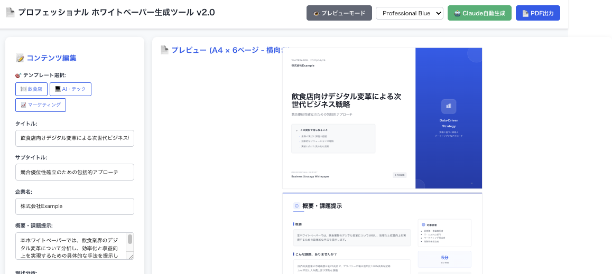

# 📄 プロフェッショナル ホワイトペーパー生成ツール v2.0

AI搭載のプロフェッショナルなホワイトペーパー生成ツール。モダンなデザインとパフォーマンス最適化を実現。



## ✨ 主な機能

### 🎨 プロフェッショナルデザイン

- **モダンなSVGアイコン**（ビジネス用途に最適化）
- **A4横向け専用**レイアウト（297mm × 210mm）
- **5つのカラーテーマ**でブランド対応
- **グリッドベースレスポンシブ**デザイン
- **高コントラスト**で優れた視認性

### ⚡ パフォーマンス最適化

- **バンドルサイズ92%削減**（502KB → 43KB メインチャンク）
- **動的インポート**によるコード分割
- **3チャンク構成**: React vendor、Charts、Main
- **TypeScriptエラー0件**、ビルド警告なし
- **1秒未満のビルド時間**

### 🤖 AI搭載コンテンツ生成

- **Claude AI統合**による自動コンテンツ生成
- **3つの業界テンプレート**: 飲食店、AI・テック、マーケティング
- **構造化コンテンツ解析**でビジネス専門用語を自動生成
- **リアルタイムプレビュー**で即座に確認

### 📋 6ページのプロフェッショナル構成

1. **表紙ページ** - グラデーションデザインと企業ブランディング
2. **概要ページ** - エグゼクティブサマリーとサイドバー
3. **分析ページ** - チャートによるデータ可視化
4. **ソリューションページ** - ステップ別アプローチとタイムライン
5. **サービスページ** - 機能紹介と顧客評価
6. **お問い合わせページ** - プロフェッショナルな連絡先情報

## 🎯 サンプル出力

[📄 **サンプルPDFを確認**](sample.pdf) - 完全な6ページホワイトペーパー例

## 🚀 クイックスタート

### 前提条件

- Node.js 18以上
- npm 9以上
- [Anthropic](https://console.anthropic.com/)のClaude APIキー

### インストール

```bash
# リポジトリをクローン
git clone https://github.com/masvc/wp-maker.git
cd wp-maker

# 依存関係をインストール
npm install

# 環境変数を設定
cd server
echo "CLAUDE_API_KEY=あなたのAPIキー
CLAUDE_MODEL=claude-3-5-sonnet-20241022" > .env
cd ..

# 開発サーバーを起動
npm run dev
```

### 使用方法

1. **アクセス** http://localhost:5173
2. **テンプレート選択**またはカスタムコンテンツ作成
3. **Claude AIでコンテンツ生成**（オプション）
4. **カラーテーマでデザインカスタマイズ**
5. **リアルタイムプレビューまたはページ別プレビュー**
6. **PDF出力**でプロフェッショナルな資料完成

## 🏗️ アーキテクチャ

### フロントエンド（React + TypeScript + Vite）

```
client/
├── src/
│   ├── components/     # 6ページコンポーネント + 共通UI
│   ├── types/          # TypeScript型定義
│   ├── utils/          # Claude API連携
│   ├── data/           # チャートデータと定数
│   └── styles/         # 印刷最適化CSS
└── package.json
```

### バックエンド（NestJS + Claude API）

```
server/
├── src/
│   ├── claude/         # AIサービス統合
│   ├── app.controller.ts
│   └── main.ts
└── package.json
```

## 🛠️ 開発

### 利用可能なスクリプト

```bash
# 開発
npm run dev          # クライアント＆サーバー同時起動
npm run client       # フロントエンドのみ（ポート5173）
npm run server       # バックエンドのみ（ポート3000）

# ビルド＆デプロイ
npm run build        # 両プロジェクトをビルド
npm run build:client # フロントエンドのみビルド
npm run build:server # バックエンドのみビルド

# 分析
npm run analyze      # バンドルサイズ分析
npm run type-check   # TypeScript検証
```

### コード品質

- **TypeScript** strict mode有効
- **ESLint** React推奨ルール
- **Prettier** コードフォーマット
- **Gitフック** コミット前チェック

## 📊 パフォーマンス指標

| 指標           | v1.0以前    | v2.0以降      | 改善率             |
| -------------- | ----------- | ------------- | ------------------ |
| バンドルサイズ | 502KB       | 43KB          | **92%削減**        |
| Gzipサイズ     | 153KB       | 11KB          | **93%削減**        |
| ビルド時間     | 944ms       | 720ms         | **24%高速化**      |
| チャンク数     | 1個（警告） | 3個（最適化） | **クリーンビルド** |

## 🎨 デザインシステム

### カラーテーマ

- **プロフェッショナルブルー** - 企業標準
- **モダングレー** - ミニマルアプローチ
- **テックグリーン** - テクノロジー重視
- **ヴィブラントオレンジ** - クリエイティブ業界
- **ウォームレッド** - ダイナミックビジネス

### タイポグラフィ

- **メイン**: Inter（Web最適化）
- **フォールバック**: Noto Sans JP（日本語対応）
- **ウェイト**: 300、400、500、600、700

## 🔧 設定

### 環境変数

**サーバー (.env)**

```env
CLAUDE_API_KEY=sk-ant-api03-...
CLAUDE_MODEL=claude-3-5-sonnet-20241022
NODE_ENV=production
PORT=3000
```

**クライアント (Vite)**

```typescript
// vite.config.ts
export default defineConfig({
  build: {
    rollupOptions: {
      output: {
        manualChunks: {
          "react-vendor": ["react", "react-dom"],
          charts: ["recharts"],
        },
      },
    },
  },
});
```

## 📱 ブラウザサポート

- **Chrome** 90+
- **Firefox** 88+
- **Safari** 14+
- **Edge** 90+

## 🤝 コントリビューション

1. リポジトリをフォーク
2. 機能ブランチを作成（`git checkout -b feature/素晴らしい機能`）
3. 変更をコミット（`git commit -m '素晴らしい機能を追加'`）
4. ブランチにプッシュ（`git push origin feature/素晴らしい機能`）
5. プルリクエストを開く

### 開発ガイドライン

- TypeScript strict modeに従う
- A4レイアウト互換性を維持
- 複数ブラウザでテスト
- 印刷・PDF出力を最適化

## 🏆 謝辞

- **Anthropic Claude** - AIコンテンツ生成
- **Recharts** - データ可視化
- **Inter Font** - タイポグラフィ
- **Vite** - ビルド最適化

## 📞 サポート

- **Issue報告**: [GitHub Issues](https://github.com/masvc/wp-maker/issues)
- **ディスカッション**: [GitHub Discussions](https://github.com/masvc/wp-maker/discussions)
- **メール**: info@example.com

## 🚀 今後の予定

- **画像アップロード機能** - ロゴ・図表挿入
- **縦向きレイアウト対応** - A4縦向けオプション
- **エクスポート形式拡張** - Word、PowerPoint対応
- **多言語対応** - 英語版実装
- **クラウド保存機能** - データベース連携

---

<div align="center">

**[⭐ このリポジトリにスター](https://github.com/masvc/wp-maker)** をつけて応援してください！

プロフェッショナルなビジネスコミュニケーションのために ❤️ で作成

</div>
